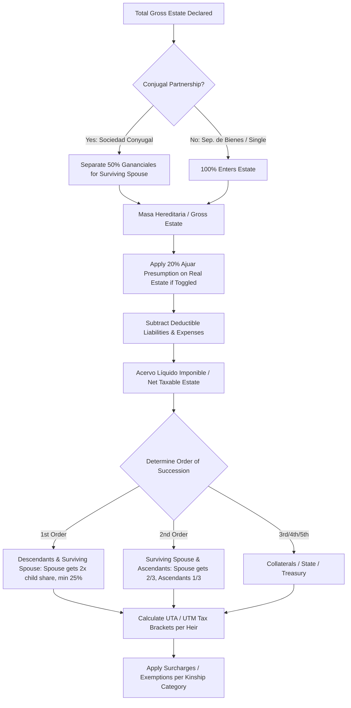

# Inheritance

An open-source LegalTech application and calculation engine for Chilean inheritance distribution and "Posesión Efectiva" (intestate succession) tax management, conforming strictly to the **Chilean Civil Code (Arts. 980+)**, **Inheritance and Donation Tax Law (Law N° 16.271)**, and the **Intestate Succession Procedure Law (Law N° 19.903)**.

---

## Table of Contents

- [Overview & Product Vision](#overview--product-vision)
- [Modes of Operation](#modes-of-operation)
- [Chilean Legal Engine & Calculation Rules](#chilean-legal-engine--calculation-rules)
  - [1. Marital Property & Gananciales (50% Split)](#1-marital-property--gananciales-50-split)
  - [2. Statutory Presumptions & Ajuar (20% Rule)](#2-statutory-presumptions--ajuar-20-rule)
  - [3. Orders of Succession](#3-orders-of-succession)
  - [4. Progressive Inheritance Tax (Law 16.271, Art. 2)](#4-progressive-inheritance-tax-law-16271-art-2)
- [Architecture & Tech Stack](#architecture--tech-stack)
- [Project Directory Layout](#project-directory-layout)
- [Getting Started & Development Setup](#getting-started--development-setup)
  - [Option A: Docker Compose & Dev Container (Recommended)](#option-a-docker-compose--dev-container-recommended)
  - [Option B: Local Host Setup](#option-b-local-host-setup)
- [Environment Configuration](#environment-configuration)
- [Development Commands & Linting](#development-commands--linting)
- [Network & Port Configuration Gotchas](#network--port-configuration-gotchas)
- [Authoritative References](#authoritative-references)

---

## Overview & Product Vision

In Chile, navigating inheritance distribution and estate taxation involves complex calculations that combine civil law statutory quotas, conjugal community property divisions (_gananciales_), presumptive household goods (_ajuar_), and progressive tax brackets denominated in Monthly Tax Units (_Unidad Tributaria Mensual_ or **UTM**).

**Inheritance** provides an intuitive, robust digital solution for individuals and legal practitioners to calculate estate distributions, estimate tax liabilities, and generate official filings for the Chilean Civil Registry (_Servicio de Registro Civil e Identificación_).

---

## Modes of Operation

The system is organized around two distinct, complementary workflows:

| Feature / Attribute    | **Mode 1: Rapid Calculator** (`/calculadora`)                   | **Mode 2: Posesión Efectiva Form** (`/posesion-efectiva`)   |
| :--------------------- | :-------------------------------------------------------------- | :---------------------------------------------------------- |
| **Objective**          | Instant estimation of legal quotas and tax brackets             | Official application document generation for Civil Registry |
| **Privacy / Identity** | **100% Anonymous** (no names, RUTs, or identifying data)        | Full legal identification of decedent, heirs, and applicant |
| **Asset Entry**        | Aggregated totals per asset class (real estate, vehicles, cash) | Granular inventory with Rol numbers, patents, bank accounts |
| **Deductions & Debt**  | High-level liabilities and optional 20% ajuar toggle            | Detailed itemized debts, funeral expenses, and exemptions   |
| **Output**             | Summary table, graphical share partition, and tax report        | Official multi-section filing form ready for submission     |

---

## Chilean Legal Engine & Calculation Rules

The computation engine is strictly constrained by Chilean legislation as specified in `business_context.md`:



### 1. Marital Property & Gananciales (50% Split)

- For decedents married under _Sociedad Conyugal_ (community property), social assets are split **50% directly to the surviving spouse** as their own _gananciales_ prior to estate partition.
- **Engineering Directive:** Gananciales are never subject to inheritance tax and are separated before calculating heir quotas.

### 2. Statutory Presumptions & Ajuar (20% Rule)

- Under **Article 47 of Law N° 16.271**, the value of household furniture (_ajuar_) is legally presumed to equal **at least 20% of the fiscal assessment value** of the decedent's residential real estate, unless exempted by legal inventory.
- The system provides an interactive toggle to calculate with or without this 20% presumption.

### 3. Orders of Succession

- **1st Order (Children & Spouse, Art. 988 Civil Code):**
  - Children inherit equal parts.
  - Surviving spouse receives **twice the quota of each legitimate child**.
  - If there is only one child, the spouse's share equals that child's share.
  - **Spouse Minimum Guarantee:** The spouse's share cannot be less than **25%** of the net estate (or 25% of the total estate if there are more than 6 children).
- **2nd Order (Ascendants & Spouse, Art. 989 Civil Code):**
  - If no children exist, the surviving spouse receives **two-thirds (2/3)** and surviving parents/grandparents divide **one-third (1/3)**.
- **3rd to 5th Orders:** Siblings, collaterals up to 6th degree, or the State (_Fisco de Chile_).

### 4. Progressive Inheritance Tax (Law 16.271, Art. 2)

Tax is calculated per heir based on their individual net share converted to **UTA / UTM** (_Unidades Tributarias Anuales_):

| Net Portion per Heir (UTA) | Marginal Rate | Surcharges / Kinship Exemptions                                                       |
| :------------------------- | :-----------: | :------------------------------------------------------------------------------------ |
| **Up to 50 UTA**           |      1%       | **Category 1 (Children, Spouse, Parents):** 50 UTA exempt bracket (~$38,000,000 CLP). |
| **50 – 100 UTA**           |     2.5%      | **Category 2 (Siblings, Nephews/Nieces):** 5 UTA exempt bracket; 20% surcharge.       |
| **100 – 200 UTA**          |      5%       | **Category 3 (Colaterals 3rd/4th degree):** No exempt bracket; 40% surcharge.         |
| **200 – 400 UTA**          |     7.5%      |                                                                                       |
| **400 – 600 UTA**          |      10%      |                                                                                       |
| **600 – 800 UTA**          |      15%      |                                                                                       |
| **800 – 1,200 UTA**        |      20%      |                                                                                       |
| **Over 1,200 UTA**         |      25%      |                                                                                       |

---

## Architecture & Tech Stack

```
                                  ┌────────────────────────┐
                                  │   Browser / Client     │
                                  │  React 19 + TypeScript │
                                  └───────────┬────────────┘
                                              │ HTTP / JSON (Port 5173 -> 8000)
                                              ▼
┌──────────────────────────────────────────────────────────────────────────────┐
│  Django REST Framework (Backend Service)                                     │
│  ├── /api/health/             - Container & database health check            │
│  ├── /api/calculate/          - Mode 1 anonymous estate distribution engine  │
│  └── /api/posesion-efectiva/  - Mode 2 Civil Registry form data handling     │
└─────────────────────────────────────┬────────────────────────────────────────┘
                                      │ PostgreSQL Protocol (Port 5432)
                                      ▼
                       ┌─────────────────────────────┐
                       │  PostgreSQL 16 Database     │
                       │  (Postgres container / db)  │
                       └─────────────────────────────┘
```

- **Frontend:**
  - **React 19** + **Vite 8** + **TypeScript 6**
  - **Tailwind CSS v4** (`@tailwindcss/vite`) with custom LegalTech Material 3 tokens
  - **React Router v7** (`react-router-dom`)
  - **Linter:** `oxlint` (high-performance Rust-based linter)
- **Backend:**
  - **Python 3.12** + **Django 5.x** + **Django REST Framework (DRF)**
  - `django-cors-headers` + `python-dotenv` + `psycopg2-binary`
- **Database:**
  - **PostgreSQL 16**

---

## Project Directory Layout

```
Inheritance/
├── .devcontainer/
│   └── docker-compose.yml       # Multi-service stack (db, backend, frontend)
├── backend/
│   ├── api/                     # REST API endpoints, serializers, domain engine
│   ├── config/                  # Django project settings and root urls
│   ├── Dockerfile               # Python/Django container image
│   ├── manage.py
│   └── requirements.txt
├── frontend/
│   ├── public/
│   │   └── favicon.svg          # LegalTech scales & calculation SVG favicon
│   ├── src/
│   │   ├── components/          # Reusable UI: NavBar, Footer, Logo, ThemeToggle
│   │   ├── hooks/               # useTheme hook (Light/Dark sync + storage)
│   │   ├── pages/               # Home, CalculadoraPage, PosesionEfectivaPage
│   │   ├── App.tsx              # Router and layout configuration
│   │   └── index.css            # Tailwind v4 theme tokens & responsive styles
│   ├── package.json
│   └── vite.config.ts           # Vite + Tailwind + React plugins
├── AGENTS.md                    # Pair-programming instructions & environment rules
├── business_context.md          # Authoritative Chilean inheritance legal specification
└── README.md                    # Project documentation
```

---

## Getting Started & Development Setup

### Option A: Docker Compose & Dev Container (Recommended)

The easiest way to run the full stack is using the Dev Container or Docker Compose:

1. **Clone the repository and copy the environment file:**

   ```bash
   git clone <repo-url>
   cd Inheritance
   cp .env.example .env
   ```

2. **Start the containers:**

   ```bash
   docker compose -f .devcontainer/docker-compose.yml up -d
   ```

3. **Verify running services:**
   - **Frontend Application:** [http://localhost:5173](http://localhost:5173)
   - **Backend API Health Check:** [http://localhost:8000/api/health/](http://localhost:8000/api/health/)
   - **PostgreSQL Database:** Exposed on host port `5433` (container port `5432`).

---

### Option B: Local Host Setup

#### 1. Backend Setup

```bash
cd backend
python3 -m venv venv
source venv/bin/activate
pip install -r requirements.txt

# Run migrations and start Django
python manage.py migrate
python manage.py runserver 0.0.0.0:8000
```

#### 2. Frontend Setup

```bash
cd frontend
npm install
npm run dev
```

---

## Environment Configuration

Configuration variables are managed via `.env` at the root of the project:

```env
# PostgreSQL Settings
POSTGRES_DB=inheritance_db
POSTGRES_USER=postgres
POSTGRES_PASSWORD=postgres
POSTGRES_HOST=db       # Use 'localhost' if running Django outside Docker
POSTGRES_PORT=5432     # Internal container port (Host exposes 5433)

# Django Settings
DJANGO_SECRET_KEY=local-dev-secret-key-change-in-production
DJANGO_DEBUG=True

# Frontend Settings
VITE_API_URL=http://localhost:8000/api
```

---

## Development Commands & Linting

### Frontend (`frontend/`)

- **Start Dev Server:** `npm run dev`
- **Production Build:** `npm run build` (runs `tsc -b && vite build`)
- **Lint Codebase:** `npm run lint` _(runs `oxlint`, fast Rust linter)_

### Backend (`backend/`)

- **Apply Migrations:** `python manage.py migrate`
- **Create Migrations:** `python manage.py makemigrations`
- **Run Server:** `python manage.py runserver 0.0.0.0:8000`

---

## Network & Port Configuration Gotchas

- **PostgreSQL Host Port:** PostgreSQL is mapped to host port **`5433`** to avoid conflicts with any local PostgreSQL instances on default port `5432`. Inside the Docker network, Django connects directly to `db:5432`.
- **CORS Allowlist:** Django `settings.py` is pre-configured to permit requests from `http://localhost:5173` and `http://127.0.0.1:5173`.
- **Language & Locales:** Chilean Spanish (`es-cl` / `es-es`) is used throughout all user interfaces, field labels, and currency formatting (`$ CLP`).

---

## Authoritative References

- `business_context.md` — Comprehensive domain model, JSON calculation schemas, and legal citations.
- `AGENTS.md` — Engineering directives and repository conventions.
- **Civil Code of Chile (Código Civil):** Book III, Titles I–VII (Arts. 980 to 1007).
- **Law N° 16.271:** Inheritance, Allocations, and Donations Tax Law.
- **Law N° 19.903:** Procedure for Intestate Possession before the Civil Registry and Identification Service.

---

### License & Legal Notice

This software is designed as an advisory and calculation tool according to Chilean law. Formal filings must be validated by the respective parties or legal counsel before submission to the _Servicio de Registro Civil e Identificación_ or _Servicio de Impuestos Internos (SII)_.
